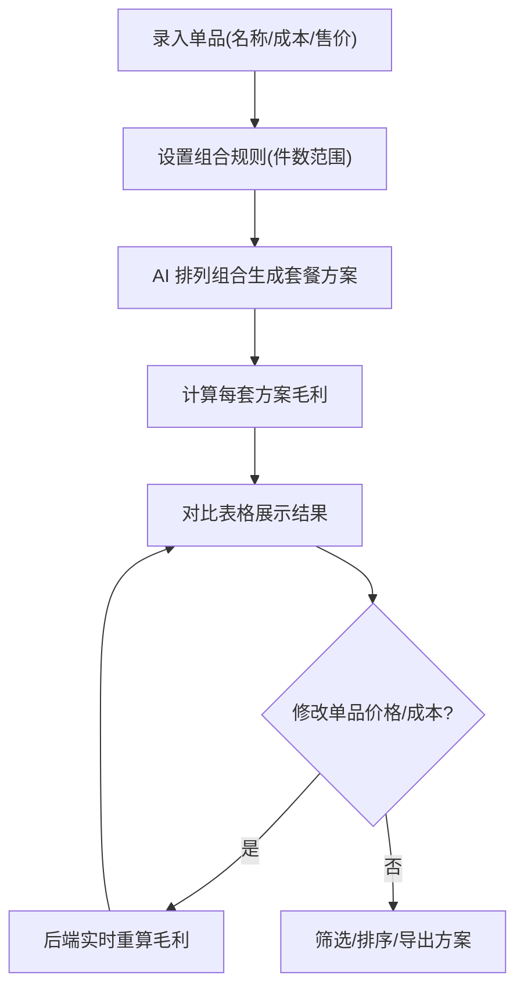

## 1. 产品概述

线下小店套餐搭配毛利测算工具，帮助小店经营者通过手动录入单品成本价与售卖单价，由 AI 自动排列组合生成多套商品捆绑套餐方案，并实时计算每套方案的单件毛利与整体总毛利，以对比表格直观展示不同搭配方案的收益差距。

- 目标用户：线下小店经营者、店铺管理人员
- 核心价值：消除手动计算套餐毛利的繁琐流程，秒级推演多种捆绑方案的经济效益，辅助定价与组合决策

## 2. 核心功能

### 2.1 用户角色

| 角色 | 使用方式 | 核心权限 |
|------|----------|----------|
| 店铺经营者 | 直接访问页面 | 录入商品、查看方案、调整参数 |

### 2.2 功能模块

1. **商品管理页面**：单品录入（成本价、售卖单价）、商品列表编辑与删除
2. **套餐方案推演页面**：AI 自动生成捆绑套餐组合、毛利计算结果对比表格、方案筛选与排序
3. **参数配置页面**：套餐组合规则配置（最少/最多捆绑件数）、毛利率阈值告警设置

### 2.3 页面详情

| 页面名称 | 模块名称 | 功能描述 |
|----------|----------|----------|
| 商品管理页面 | 商品录入表单 | 输入商品名称、成本价、售卖单价，支持快速添加多款单品 |
| 商品管理页面 | 商品列表 | 展示已录入的全部单品，支持内联编辑售价/成本、删除商品 |
| 套餐方案推演页面 | 套餐生成控制 | 设置组合件数范围后，一键触发 AI 排列组合生成多套套餐方案 |
| 套餐方案推演页面 | 方案对比表格 | 每行展示一套套餐方案，包含组合商品、单件毛利、总毛利、毛利率、套餐建议售价 |
| 套餐方案推演页面 | 毛利走势图 | 按毛利率排序的可视化图表，直观对比各方案收益 |
| 参数配置页面 | 组合规则配置 | 设置最少捆绑件数、最多捆绑件数、是否允许同商品重复搭配 |
| 参数配置页面 | 告警设置 | 毛利率低于阈值时高亮标红提醒 |

## 3. 核心流程

1. 操作人员在商品管理页面录入多款在售单品的成本价与售卖单价
2. 系统根据组合规则自动排列组合，生成所有可能的商品捆绑套餐
3. 对每套套餐计算：单件毛利 = 售价 - 成本；总毛利 = 各单品毛利之和；毛利率 = 总毛利 / 总售价
4. 在对比表格中展示全部方案，支持按毛利率/总毛利排序
5. 操作人员修改任意单品价格或成本后，后端实时重新计算并刷新所有方案数据

## 4. 用户界面设计

### 4.1 设计风格

- 主色调：深墨绿 (#1B4332) + 金色点缀 (#D4A843)，营造专业且高端的商业测算感
- 辅助色：浅灰背景 (#F5F5F0)、白色卡片、红色告警 (#E63946)
- 按钮风格：圆角 8px，主按钮深墨绿实心，次要按钮描边
- 字体：Noto Sans SC（中文）+ DM Serif Display（数字展示），数据区域使用等宽字体
- 布局风格：左侧导航 + 右侧内容区，卡片式模块布局
- 图标风格：线性图标，2px 描边

### 4.2 页面设计概览

| 页面名称 | 模块名称 | UI 元素 |
|----------|----------|----------|
| 商品管理页面 | 商品录入表单 | 白色卡片，3列输入框(名称/成本/售价)，绿色添加按钮 |
| 商品管理页面 | 商品列表 | 表格布局，行内可编辑数字输入框，悬停高亮行，删除按钮 |
| 套餐方案推演页面 | 套餐生成控制 | 卡片内数字步进器(件数范围)，大号绿色"生成方案"按钮 |
| 套餐方案推演页面 | 方案对比表格 | 条纹背景表格，毛利率列用色条标记高低，低毛利行标红 |
| 套餐方案推演页面 | 毛利走势图 | 横向柱状图，绿色渐变填充，悬停显示详细数值 |
| 参数配置页面 | 组合规则配置 | 卡片式分组，滑块+数字输入组合控件 |
| 参数配置页面 | 告警设置 | 阈值输入框 + 颜色预览条 |

### 4.3 响应式

- 桌面优先设计，最小宽度 1280px
- 平板端表格可横向滚动
- 移动端折叠导航为汉堡菜单

### 4.4 3D 场景指引

不适用
