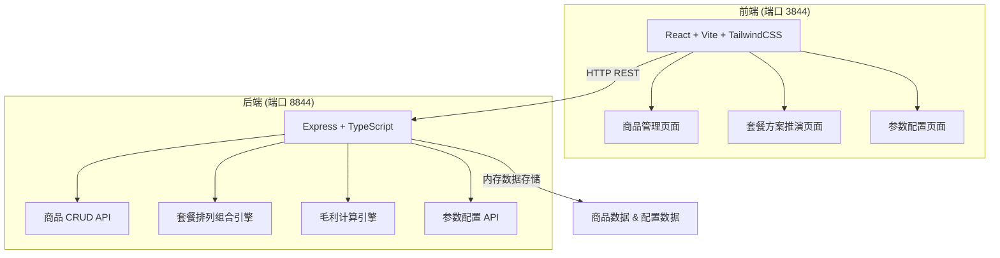
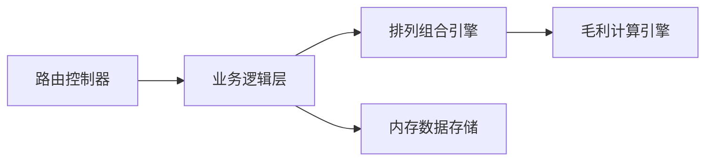
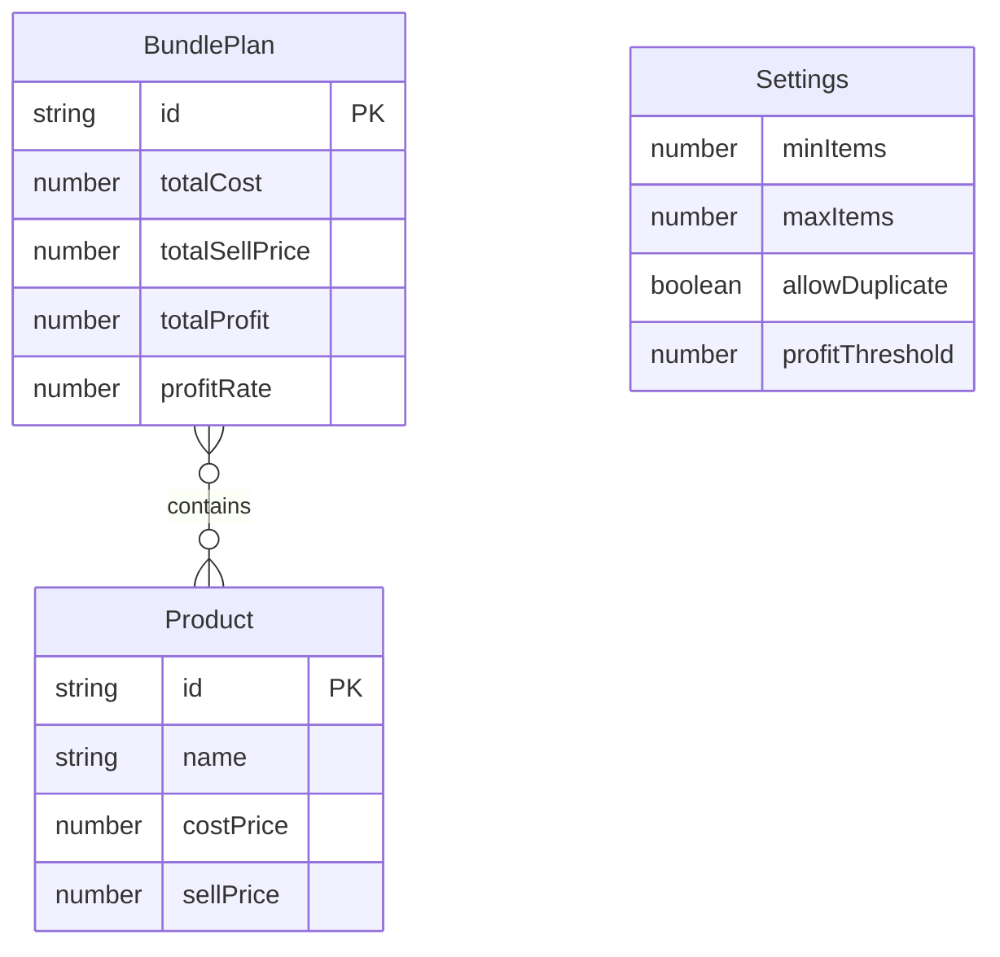

## 1. 架构设计



## 2. 技术说明

- 前端：React@18 + TailwindCSS@3 + Vite，运行在端口 3844
- 初始化工具：Vite
- 后端：Express@4 + TypeScript，运行在端口 8844
- 数据库：无外部数据库，使用内存数据存储（服务重启数据清零，符合纯页面输入校验需求）
- 图表库：Recharts（毛利走势图）

## 3. 路由定义

| 路由 | 用途 |
|------|------|
| / | 商品管理页面 - 录入和编辑单品 |
| /plans | 套餐方案推演页面 - 生成和对比套餐方案 |
| /settings | 参数配置页面 - 组合规则与告警设置 |

## 4. API 定义

### 4.1 商品管理

```typescript
interface Product {
  id: string;
  name: string;
  costPrice: number;
  sellPrice: number;
}

// GET /api/products - 获取全部商品
// Response: Product[]

// POST /api/products - 添加商品
// Request: Omit<Product, 'id'>
// Response: Product

// PUT /api/products/:id - 更新商品
// Request: Partial<Omit<Product, 'id'>>
// Response: Product

// DELETE /api/products/:id - 删除商品
// Response: { success: boolean }
```

### 4.2 套餐方案生成

```typescript
interface BundlePlan {
  id: string;
  products: Product[];
  totalCost: number;
  totalSellPrice: number;
  totalProfit: number;
  profitRate: number;
  profitDetails: {
    productId: string;
    productName: string;
    costPrice: number;
    sellPrice: number;
    profit: number;
    profitRate: number;
  }[];
}

interface GenerateRequest {
  minItems: number;
  maxItems: number;
  allowDuplicate: boolean;
  profitThreshold?: number;
}

// POST /api/bundle-plans/generate - 生成套餐方案
// Request: GenerateRequest
// Response: BundlePlan[]

// GET /api/bundle-plans - 获取已生成的方案
// Response: BundlePlan[]
```

### 4.3 参数配置

```typescript
interface Settings {
  minItems: number;
  maxItems: number;
  allowDuplicate: boolean;
  profitThreshold: number;
}

// GET /api/settings - 获取配置
// Response: Settings

// PUT /api/settings - 更新配置
// Request: Partial<Settings>
// Response: Settings
```

## 5. 服务架构图



## 6. 数据模型

### 6.1 数据模型定义



### 6.2 数据定义语言

本系统使用内存存储，数据结构定义如下：

```sql
-- 仅供参考，实际使用内存 Map 存储
CREATE TABLE products (
  id VARCHAR(36) PRIMARY KEY,
  name VARCHAR(100) NOT NULL,
  cost_price DECIMAL(10,2) NOT NULL,
  sell_price DECIMAL(10,2) NOT NULL
);

CREATE TABLE settings (
  id INT PRIMARY KEY DEFAULT 1,
  min_items INT DEFAULT 2,
  max_items INT DEFAULT 5,
  allow_duplicate BOOLEAN DEFAULT FALSE,
  profit_threshold DECIMAL(5,4) DEFAULT 0.15
);
```

### 6.3 排列组合引擎核心算法

1. 根据配置的 minItems 和 maxItems 确定组合长度范围
2. 对商品列表进行 C(n,k) 组合计算（k 从 minItems 到 maxItems）
3. 若 allowDuplicate 为 true，则使用可重复组合 H(n,k) = C(n+k-1, k)
4. 对每个组合计算毛利：
   - 单件毛利 = 售价 - 成本
   - 总毛利 = Σ 单件毛利
   - 毛利率 = 总毛利 / 总售价 × 100%
5. 按毛利率降序排列返回全部方案
